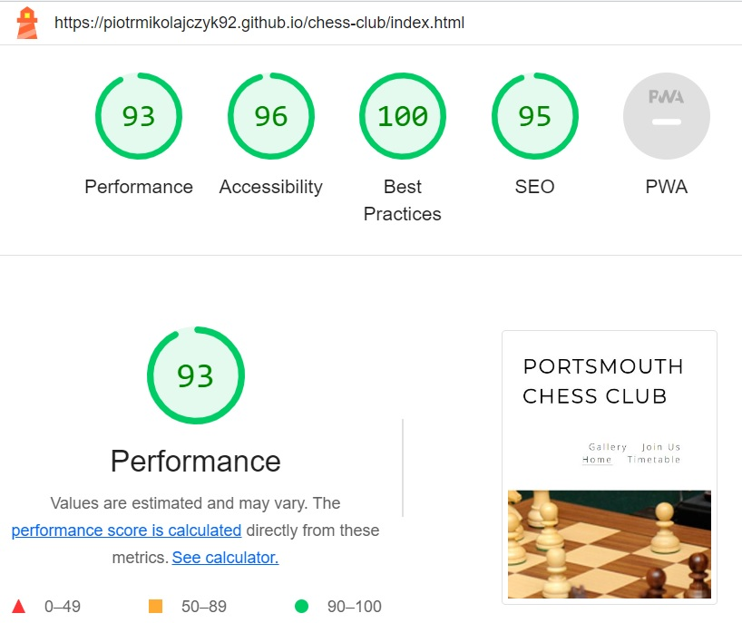
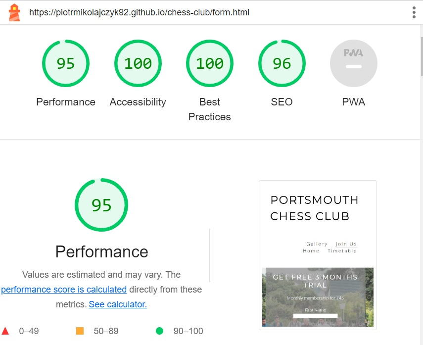
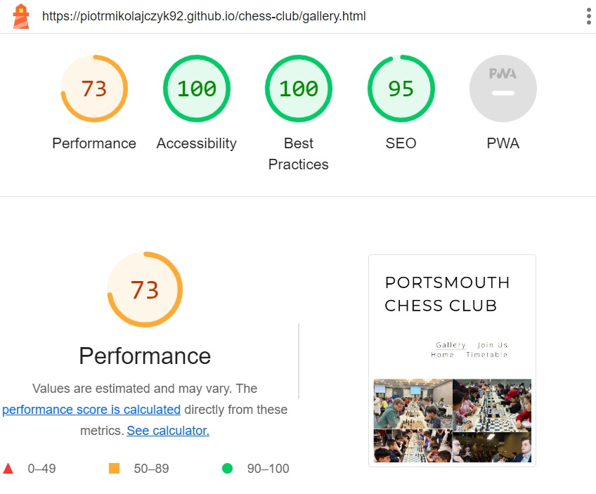
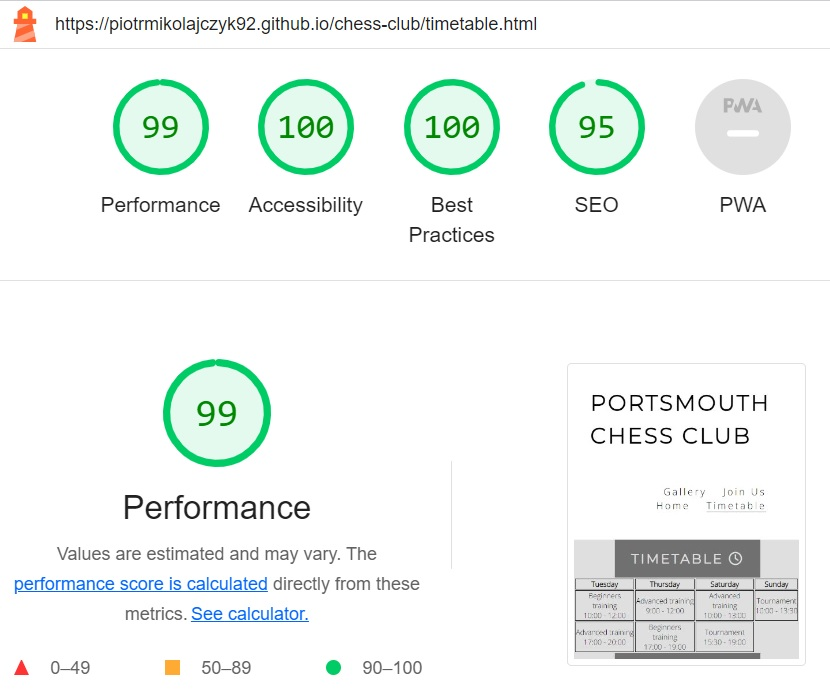

<h1>Portsmouth Chess Club</h1>

Portsmouth Chess Club is a website for people interested in playing chess and joining its big community.

Users of this website will be able to find all essential informations about the Club, address, opening times,
        trainings timetable, links to social medias, gallery and sign up form.

 

 
<h1>Features</h1>
    <ul>
    <h2>Site Wide</h2>
        <li>
        <h2>Navigation</h2>
            <ul>
                <li>Featured at the top of the page, shows the Club name on the left which links to the main page and
                    navigation links on the right: Home, Timetable, Gallery, Join Us which link to different sections.
                </li>
                <li>The font color contrasts with the background so it's easy to read and responsive on all devices.</li>
                <li>This allows user to easily navigate between the pages within the site on any size device.</li>
                <li>Each navigation link will be underlined in relation to the user's current section displayed.</li>
            </ul>
             
            
             
        </li>
        <li>
        <h2>Footer</h2>
            <ul>
                <li>This will contain icons as links to social media websites that will open in new tabs. Icons will be
                    accessible to the visually impaired who may be using a screen reader, by the use of aria labels.</li>
                <li>This will allow the user to follow the Club on social medias to be more up to date with all the Club
                    events.</li>
            </ul>
             
            
             
        </li>
        <li>
        <h2>Favicon</h2>
            <ul>
                <li>A site wide favicon implemented.</li>
                <li>This will provide an image in the the tabs header to allow the user to easily identify the website if
                    they have multiple tabs open.</li>
            </ul>
         
        
         
        </li>
    </ul>
    <h2>Landing Page</h2>
        <ul>
            <li>
            <h2>Hero image and cover text</h2>
                <ul>
                <li>The hero image shows a picture of chess board zooming out on loading page creating eye catching effect.</li>
                <li>Cover text contains a name of the club, address and email address. Its background color corresponds to hero
                image's dominant color</li>
                </ul>
             
            
             
            </li>
            <li>
            <h2>Club Ethos</h2>
                <ul>
                <li>This section explains user the main benefits of playing chess.</li>
                </ul>
             
             
             
            </li>
        </ul>
    <h2>Timetable Page</h2>
        <ul>
            <li>This section provides the user with clear information about the club offers their members and has a table with club opening and meeting times.</li>
            <li>This section shows the user what the club offers to its members.</li>
         
        
         
        </ul>
    <h2>Gallery Page</h2>
    <ul>
        <li>The gallery will provide the user with photos of club's premises and events which take place in there.</li>
     
    
     
    </ul>
    <h2>Sign Up Page</h2>
    <ul>
        <li>The sign up page has a form to collect details from people willing to join the Club.</li>
        <li>The form collects a name, surname and an email address</li>
        <li>It gives the ability to sign up to join the Club</li>
     
    
     
    </ul>
<h1>Technologies</h1>
    <ul>
        <li>HTML
            <ul>
                <li>
                    The structure of the Website was developed using HTML as the main language.
                </li>
            </ul>
        </li>
        <li>CSS
            <ul>
                <li>
                    The Website was styled using custom CSS in an external file.
                </li>
            </ul>
        </li>
        <li>GitHub
            <ul>
                <li>
                    Source code is hosted on GitHub
                </li>
            </ul>
        </li>
        <li>Font Awesome
            <ul>
                <li>
                    Icons obtained from <a href="https://fontawesome.com/" target="_blank">https://fontawesome.com/</a> were used as the Social media links in the footer section.
                </li>
            </ul>
        </li>
        <li>Favicon.io
            <ul>
                <li>
                    Favicon files were created at <a href="https://favicon.io/favicon-converter/" target="_blank">https://favicon.io/favicon-converter/</a>
                </li>
            </ul>
        </li>
    </ul>
<h1>Testing</h1>
    <ul>
        <li>I tested that this website works on different browsers: Chrome, Firefox</li>
        <li>I confirmed that this website is responsive, looks good and functions on all standard screen sizes using the devtools device toolbar.</li>
        <li>I confirmed that the header, navigation, footer, timetable and sign up are all readable and easy to understand.</li>
        <li>I have confirmed that the form works: requires entries in every field, will only accept an email in the email field and the submit button works.</li>
    </ul>
<h1>Bugs</h1>
    <ul>
        <li>The order of navigation links changes when screen shrinks. I was unable to resolve this bug on time but will address in a future release.</li>
    </ul>
<h1>Validator Testing</h1>
    <ul>
        <li>HTML
            <ul>
                <li>
                    No errors were returned when passing through the official W3C validator.
                </li>
            </ul>
        </li>
        <li>CSS
            <ul>
                <li>
                    No errors were found when passing through the official (Jigsaw) validator.
                </li>
            </ul>
        </li>
        <li>Accesibility
            <ul>
                <li>
                    I confirmed that the colors and fonts chosen are easy to read and accessible by running it through lighthouse in devtools.
                </li>
                 
                
                
                
                
                 
            </ul>
        </li>
    </ul>
<h1>Deployment</h1>
    <ul>
        <li>The site was deployed to GitHub pages. The steps to deploy are as follows:
            <ul>
                <li>In the GitHub repository, navigate to the Settings tab.</li>
                <li>From the source section drop-down menu, Select the Master Branch.</li>
                <li>Once the master branch has been selected, the page provided the link to the completed website.</li>
            </ul>
        </li>
    </ul>
    The live link can be found here - <a href="https://piotrmikolajczyk92.github.io/chess-club/index.html" target="_blank">Portsmouth Chess Club</a>
<h1>Credits</h1>
    <h2>Content</h2>
        <ul>
            <li>The content for Club Ethos section was taken from <a href="https://www.chess.com/pl/article/view/10-najwazniejszych-zalet-grania-w-szachy#:~:text=1%20%C5%81%C4%85cz%C4%85%20ludzi%202%20Ucz%C4%85%20jak%20wygrywa%C4%87%20i,8%20Pomagaj%C4%85%20rozwija%C4%87%20umiej%C4%99tno%C5%9B%C4%87%20rozwi%C4%85zywania%20problem%C3%B3w%20More%20items" target="_blank">www.chess.com/pl/</a> and translated into English.</li>
        </ul>
    <h2>Media</h2>
        <ul>
            <li>Photos used in this project were found on Google Images.</li>
        </ul>
</body>
</html>
